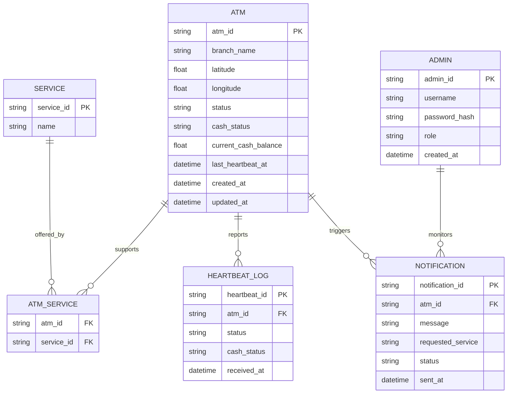

# Smart ATM Routing System (SARS)

A real-time, location-based platform that shifts the ATM-locator problem from "nearest machine" to "nearest **available and operational** machine that actually holds the cash the customer needs."

---

## Description

When an ATM goes out of service, runs low on cash, or doesn't hold enough cash for a specific withdrawal, SARS detects it instantly (via heartbeats), calculates the best alternative machines in real time (distance + ETA + cash sufficiency), and routes the customer there — on the ATM screen and via SMS. Bank admins get a live map of the whole network, with instant WebSocket updates and a full notification audit log that never stores the customer's phone number.

The system has three moving parts:

1. **Kiosk** — the screen on the physical ATM (customer-facing)
2. **Admin Dashboard** — internal web app for bank operations staff
3. **Backend API** — routing logic, heartbeat processing, SMS dispatch, WebSocket push

---

## Architecture Overview

```
 Customer                Bank Admin
    │                        │
    ▼                        ▼
┌─────────┐            ┌──────────────┐
│  Kiosk  │            │Admin Dashboard│
│ (React) │            │   (React)     │
└────┬────┘            └──────┬───────┘
     │ REST/HTTPS              │ REST/HTTPS + WebSocket
     │ (X-API-Key)              │ (JWT)
     ▼                          ▼
┌─────────────────────────────────────────┐
│              Backend API                  │
│         (Django REST + Channels)          │
└───┬───────────┬───────────────┬──────────┘
    │            │               │
    ▼            ▼               ▼
┌────────┐  ┌──────────┐  ┌─────────────┐
│Postgres│  │  Task     │  │ WebSocket    │
│+PostGIS│  │  Queue    │  │  Server      │
└────────┘  │(Celery +  │  └──────┬──────┘
            │  Redis)   │         │
            └─┬───────┬─┘         ▼
              │         │    Admin Dashboard
              ▼         ▼    (live push)
        ┌──────────┐ ┌─────────┐
        │  Mapping  │ │   SMS   │
        │  Service  │ │ Gateway │
        │(Google Maps)│ (Twilio)│
        └──────────┘ └─────────┘
```

- **Kiosk** talks to the Backend API only via API Key — no login, no JWT.
- **Admin Dashboard** authenticates with JWT and keeps a live WebSocket connection open for real-time status pushes.
- **Task Queue** (Celery) handles every external call (Google Maps, Twilio) asynchronously so the kiosk screen is never blocked.
- Full C4 container diagram, class diagram, ERD, and sequence diagram live in [`docs/diagrams/`](./docs/diagrams/).

---

## Tech Stack

| Layer             | Technology                                                             |
| ----------------- | ---------------------------------------------------------------------- |
| Backend           | Django, Django REST Framework, Django Channels (ASGI/WebSocket)        |
| Async tasks       | Celery + Redis                                                         |
| Database          | PostgreSQL + PostGIS (geo queries for radius search)                   |
| Auth              | JWT (`djangorestframework-simplejwt`) for Admin, API Key for ATM/Kiosk |
| Admin Dashboard   | React, Vite, Tailwind CSS, Zustand (or Redux Toolkit), `lucide-react`  |
| Kiosk             | React, Vite, lightweight in-memory state (no router, no persistence)   |
| External services | Google Maps Distance Matrix API, Twilio (SMS)                          |
| Infra             | Docker, Docker Compose, GitHub Actions (CI)                            |
| Testing           | pytest + pytest-django (backend), Jest/Vitest (frontend & kiosk)       |

---

## Team & Tasks

| Member      | Primary ownership                                                                                              |
| ----------- | -------------------------------------------------------------------------------------------------------------- |
| **عبدالله** | Infra + project config, `backend/accounts/` (Auth & RBAC), `kiosk/` shared scaffold + SCR-01                   |
| **محمد**    | `backend/atms/` (ATM model, heartbeat, transaction attempt, WebSocket, network stats), `kiosk/` SCR-05, SCR-06 |
| **سارة**    | `backend/routing/` (Routing Engine + cash-sufficiency filter), `backend/notifications/` (SMS)                  |
| **صفية**    | `frontend/` (Admin Dashboard, all 3 screens), `kiosk/` SCR-02, SCR-03, SCR-04                                  |

Kiosk screen split — simpler screens went to whoever finishes backend first; the screens with branching logic (multiple `reason` states, dynamic alternatives) stayed with صفية alongside the dashboard:

| Screen                              | Owner   |
| ----------------------------------- | ------- |
| SCR-01 — Select service & amount    | عبدالله |
| SCR-02 — Checking status            | صفية    |
| SCR-03 — Unavailable (reason-based) | صفية    |
| SCR-04 — Alternatives list          | صفية    |
| SCR-05 — Phone number entry         | محمد    |
| SCR-06 — Confirmation               | محمد    |

Full per-file checklist: [`SARS-Task-Breakdown.md`](./SARS-Task-Breakdown.md). Dependency order and rationale are documented there — check it before starting any file.

---

## Database Entities (ERD)



| Entity                    | Purpose                                                                                 |
| ------------------------- | --------------------------------------------------------------------------------------- |
| `ATM`                     | One row per physical machine — status, cash status, exact balance, coordinates          |
| `SERVICE` / `ATM_SERVICE` | Which services (withdrawal, deposit, ...) each ATM supports                             |
| `HEARTBEAT_LOG`           | Append-only history of every status payload received                                    |
| `NOTIFICATION`            | SMS audit log — **never stores the customer's phone number** (Data Minimization, NFR 4) |
| `ADMIN`                   | Bank staff accounts, `role` drives RBAC (`ADMIN` / `SUPER_ADMIN`)                       |

---

## Folder Structure

```
sars-project/
├── .git/
├── .gitignore                    # venv, node_modules, .env, __pycache__, media/
├── .env.example                  # 🆕 template for root-level shared vars (if any)
├── README.md                     # project overview + setup steps for the team
├── docker-compose.yml            # runs backend + frontend + db + redis together
│
├── docs/                         # 🆕 keeps diagrams & contract versioned with the code
│   ├── diagrams/
│   │   ├── class-diagram.md
│   │   ├── erd.md
│   │   ├── c4-container-diagram.md
│   │   └── sequence-diagram.md
│   └── api-contract.md
│
├── .github/                      # 🆕 CI/CD (NFR 5)
│   └── workflows/
│       ├── backend-ci.yml        # lint + pytest on push/PR
│       └── frontend-ci.yml       # lint + jest/vitest on push/PR
│
├── backend/                      # Django
│   ├── manage.py
│   ├── requirements.txt
│   ├── requirements-dev.txt      # 🆕 pytest, flake8/ruff, coverage
│   ├── Dockerfile
│   ├── .env.example              # 🆕 DB_URL, REDIS_URL, GOOGLE_MAPS_API_KEY,
│   │                              #     TWILIO_SID/TOKEN, JWT_SECRET, ATM_API_KEY_SALT
│   ├── pytest.ini                # 🆕
│   │
│   ├── sars_core/                # project settings (settings, urls, asgi/wsgi)
│   │   ├── settings/
│   │   │   ├── base.py
│   │   │   ├── dev.py
│   │   │   └── prod.py
│   │   ├── celery.py             # Celery config (Task Queue container)
│   │   └── asgi.py               # WebSocket entrypoint (Django Channels)
│   │
│   ├── accounts/                 # 🆕 Admin auth & RBAC (NFR 4)
│   │   ├── models.py             # Admin model (username, role: ADMIN/SUPER_ADMIN)
│   │   ├── serializers.py
│   │   ├── views.py              # /auth/login, /auth/refresh
│   │   ├── permissions.py        # IsAdmin, IsSuperAdmin (RBAC)
│   │   ├── urls.py
│   │   └── tests/                # 🆕
│   │       ├── test_login.py
│   │       └── test_permissions.py
│   │
│   ├── atms/                     # ATM management (Class: ATM, ServiceType)
│   │   ├── models.py             # ATM (incl. current_cash_balance), Service, ATM_Service
│   │   ├── serializers.py
│   │   ├── views.py              # /atms, /atms/{id}, /atms/{id}/heartbeat,
│   │   │                          #   /atms/{id}/transactions/attempt,
│   │   │                          #   🆕 /atms/network-stats (online/low-cash/offline
│   │   │                          #   counts + uptime %, backs the admin KPI row)
│   │   ├── consumers.py          # WebSocket consumer -> /ws/dashboard
│   │   ├── urls.py
│   │   └── tests/                # 🆕
│   │       ├── test_heartbeat.py
│   │       ├── test_transaction_attempt.py
│   │       └── test_websocket.py
│   │
│   ├── routing/                  # Routing Engine
│   │   ├── services.py           # 🆕 RoutingEngine class: findAlternatives(),
│   │   │                          #   filterByRadius(), cash-sufficiency filter,
│   │   │                          #   fallbackHaversine()
│   │   ├── gateways.py           # 🆕 MappingGateway wrapper (Google Maps client)
│   │   ├── views.py              # /routing/alternatives
│   │   ├── urls.py
│   │   └── tests/                # 🆕
│   │       ├── test_routing_engine.py     # incl. cash-sufficiency + buffer logic
│   │       └── test_haversine_fallback.py # mapping API failure path
│   │
│   ├── notifications/             # SMS notifications
│   │   ├── models.py             # Notification (no phone number persisted)
│   │   │                          # 🆕 requestedService field added — so the admin
│   │   │                          #   "Notifications" table can show a real confirmed-
│   │   │                          #   service column instead of parsing free text
│   │   ├── tasks.py              # Celery task: SMSService.sendSMS / dispatchAsync
│   │   ├── views.py              # /notifications/sms, /notifications/sms/{id}/status,
│   │   │                          #   /notifications (admin list)
│   │   ├── urls.py
│   │   └── tests/                # 🆕
│   │       ├── test_sms_dispatch.py
│   │       └── test_no_phone_persistence.py  # explicit NFR 4 regression test
│   │
│   └── common/                   # 🆕 shared utilities across apps
│       ├── exceptions.py         # standard error object format
│       ├── pagination.py
│       └── api_key_auth.py       # X-API-Key auth class for ATM endpoints
│
├── frontend/                     # React (Admin Dashboard — internal, bank staff only)
│   ├── package.json
│   ├── Dockerfile
│   ├── .env.example               # 🆕 VITE_API_BASE_URL, VITE_WS_URL
│   ├── public/
│   └── src/
│       ├── assets/                # images, icons, marker colors
│       ├── components/            # buttons, inputs, ATM marker, status badge
│       ├── pages/                 # Login (SCR-A1), LiveMap (SCR-A2),
│       │                          #   Notifications (SCR-A3, incl. ATM detail slide-over)
│       ├── services/              # api.js (REST calls), socket.js (WebSocket client)
│       ├── store/                 # 🆕 real-time ATM state (Redux/Zustand/Context)
│       │   ├── atmsSlice.js       # holds live status pushed via WebSocket
│       │   └── authSlice.js       # JWT/session state
│       ├── utils/                 # date/distance formatting
│       └── __tests__/             # 🆕
│           ├── components/
│           └── services/
│
└── kiosk/                        # 🆕 React (ATM Interface — embedded kiosk app, customer-facing)
    │                              #   Matches the "ATM Interface" container in the C4 diagram —
    │                              #   was already planned there but had no home until now.
    ├── package.json
    ├── Dockerfile
    ├── .env.example               # 🆕 VITE_API_BASE_URL, VITE_ATM_API_KEY, VITE_ATM_ID
    ├── public/
    └── src/
        ├── assets/                # SARS branding, service icons
        ├── components/            # ServiceGrid, AmountPad, StatusRadar, AlternativeCard,
        │                          #   PhoneInput, SuccessCheck
        ├── pages/                 # 🆕 one file per kiosk screen:
        │   ├── SelectService.jsx        # SCR-01 — service + requestedAmount
        │   ├── CheckingStatus.jsx       # SCR-02 — loading/spinner, <3s budget
        │   ├── Unavailable.jsx          # SCR-03 — reason: OFFLINE/MAINTENANCE/
        │   │                            #   NO_CASH/INSUFFICIENT_CASH
        │   ├── AlternativesList.jsx     # SCR-04 — top 3, no real balance shown
        │   ├── PhoneNumberEntry.jsx     # SCR-05 — phone input, "skip" option
        │   └── Confirmation.jsx         # SCR-06 — success state
        ├── services/
        │   └── api.js             # attemptTransaction(), getAlternatives(),
        │                          #   requestSms() — all via X-API-Key, no JWT
        ├── store/                 # 🆕 local session state only (no persistence —
        │                          #   resets every transaction; phone number never
        │                          #   written to any store/localStorage)
        │   └── sessionSlice.js
        ├── utils/
        └── __tests__/             # 🆕
            └── pages/
```

Full annotated tree with per-file responsibilities: [`SARS-Final-Folder-Structure.md`](./SARS-Final-Folder-Structure.md).

---

## Getting Started

### Prerequisites

- Docker & Docker Compose
- Node.js 18+ (only needed if running frontend/kiosk outside Docker)
- Python 3.12+ (only needed if running backend outside Docker)

### 1. Clone & configure

```bash
git clone <repo-url> sars-project
cd sars-project
cp backend/.env.example backend/.env
cp frontend/.env.example frontend/.env
cp kiosk/.env.example kiosk/.env
```

Fill in `GOOGLE_MAPS_API_KEY`, `TWILIO_*`, `JWT_SECRET`, and DB credentials in `backend/.env`.

### 2. Run everything

```bash
docker-compose up --build
```

This starts: `db` (Postgres+PostGIS), `redis`, `backend` (Django/Daphne), `celery` (worker), `frontend`, `kiosk`.

### 3. Migrate & create an admin

```bash
docker-compose exec backend python manage.py migrate
docker-compose exec backend python manage.py createsuperuser
```

### 4. Access

| Service         | URL                              |
| --------------- | -------------------------------- |
| Backend API     | http://localhost:8000/api/v1     |
| WebSocket       | ws://localhost:8000/ws/dashboard |
| Admin Dashboard | http://localhost:5173            |
| Kiosk           | http://localhost:5174            |

### 5. Run tests

```bash
docker-compose exec backend pytest
cd frontend && npm test
cd kiosk && npm test
```

---

## Features & Services

| FR  | Feature                                                                                         | Implemented in                           |
| --- | ----------------------------------------------------------------------------------------------- | ---------------------------------------- |
| FR1 | Real-time ATM monitoring (heartbeats, status, cash)                                             | `backend/atms/`                          |
| FR2 | Smart routing & alternative-location engine (incl. cash-sufficiency filter, Haversine fallback) | `backend/routing/`                       |
| FR3 | Customer kiosk interface                                                                        | `kiosk/`                                 |
| FR4 | Async SMS notification (no phone number persisted)                                              | `backend/notifications/`                 |
| FR5 | Live admin dashboard (map, filters, instant WebSocket push)                                     | `frontend/`, `backend/atms/consumers.py` |

---

## API Endpoint Reference

Base URL: `/api/v1`

| #   | Method | Endpoint                             | Consumer            | Auth              |
| --- | ------ | ------------------------------------ | ------------------- | ----------------- |
| 1   | POST   | `/atms/{atmId}/transactions/attempt` | Kiosk               | API Key           |
| 2   | POST   | `/atms/{atmId}/heartbeat`            | ATM device          | API Key           |
| 3   | POST   | `/routing/alternatives`              | Kiosk               | API Key           |
| 4   | POST   | `/notifications/sms`                 | Kiosk               | API Key           |
| 5   | GET    | `/notifications/sms/{taskId}/status` | Kiosk               | API Key           |
| 6   | GET    | `/notifications`                     | Admin               | JWT               |
| 7   | POST   | `/auth/login`                        | Admin               | None              |
| 8   | POST   | `/auth/refresh`                      | Admin               | Refresh token     |
| 9   | GET    | `/atms`                              | Admin               | JWT               |
| 10  | GET    | `/atms/{atmId}`                      | Admin               | JWT               |
| 11  | POST   | `/atms`                              | Admin (SUPER_ADMIN) | JWT               |
| 12  | PATCH  | `/atms/{atmId}`                      | Admin (SUPER_ADMIN) | JWT               |
| 13  | GET    | `/services`                          | Admin / Kiosk       | JWT / API Key     |
| 14  | GET    | `/atms/network-stats`                | Admin               | JWT               |
| 15  | WS     | `/ws/dashboard`                      | Admin               | JWT (query param) |

Full request/response fields, status codes, and error format: [`docs/api-contract.md`](./docs/api-contract.md).

---

## Route Map

### Admin Dashboard (`frontend/`)

| Route            | Screen                                                     |
| ---------------- | ---------------------------------------------------------- |
| `/login`         | SCR-A1 — Sign in                                           |
| `/live`          | SCR-A2 — Live map, KPI row, filters, ATM detail slide-over |
| `/notifications` | SCR-A3 — Notification log                                  |

### Kiosk (`kiosk/`)

No URL routing — a single linear session, step-driven by `sessionSlice.js`:

```
SelectService (SCR-01)
   → CheckingStatus (SCR-02)
       → [PROCEED] → (hands off to core banking flow, outside SARS)
       → [REDIRECT] → Unavailable (SCR-03)
           → AlternativesList (SCR-04)
               → PhoneNumberEntry (SCR-05)
                   → Confirmation (SCR-06) → resets to SelectService
```

---

## Manual Test Guide

Run these end-to-end before every release, in addition to the automated test suites.

**1. Happy path (ATM operational, cash sufficient)**

- Kiosk: select "Withdrawal", enter an amount below the ATM's `current_cash_balance` → expect `PROCEED` on SCR-02, no redirect.

**2. ATM offline → full redirect flow**

- Set an ATM's `status` to `OFFLINE` (via heartbeat or admin panel).
- Kiosk: attempt a transaction on that ATM → SCR-03 shows `reason: OFFLINE` → SCR-04 shows 3 alternatives → enter a phone number → SCR-06 confirms.
- Admin Dashboard: confirm the notification appears in `/notifications` within a few seconds, **with no phone number visible anywhere**.

**3. Insufficient cash**

- Set an ATM `ONLINE` with `current_cash_balance` just below a test `requestedAmount + buffer`.
- Kiosk: request that amount → expect `reason: INSUFFICIENT_CASH`, and confirm every alternative shown genuinely holds enough cash.

**4. Mapping API fallback**

- Temporarily break `GOOGLE_MAPS_API_KEY` (or block network to the Maps API).
- Repeat test 2 → alternatives should still return, with `distanceSource: HAVERSINE_FALLBACK`.

**5. Live dashboard real-time update**

- Open the Admin Dashboard `/live` in a browser.
- Send a heartbeat that flips an ATM's status.
- Confirm the map marker and KPI counts update **within 2 seconds**, with no page refresh.

**6. RBAC**

- Log in as `ADMIN` → attempt `POST /atms` → expect `403`.
- Log in as `SUPER_ADMIN` → same request → expect `201`.

**7. Data minimization regression check**

- Complete test 2 fully, then inspect the database directly (`SELECT * FROM notifications_notification`) → confirm no column contains the phone number in any form.
